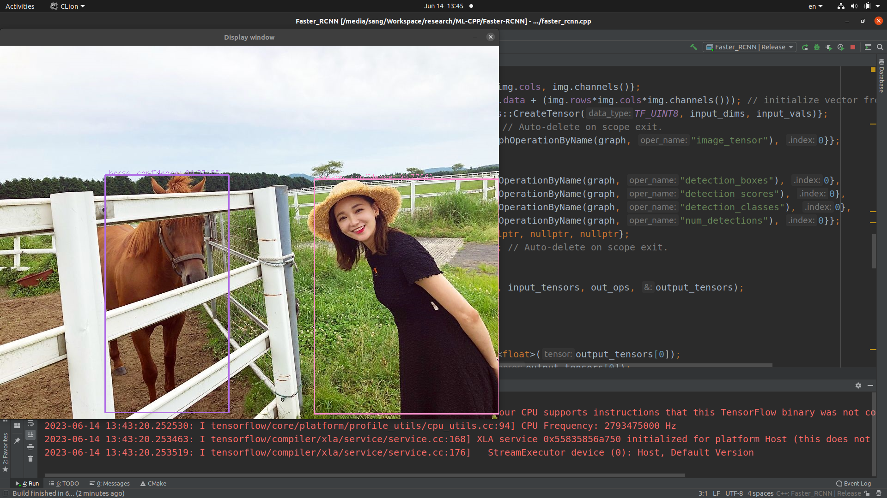

# faster-rcnn
Object detection Faster R-CNN inference with Tensorflow C API. Using Tensorflow C API, you won't need to build tensorflow C++ library.

Thanks to @Neargye for creating a C++ wrapper that makes it easier to use Tensorflow C API, details can be found <a href="https://github.com/Neargye/hello_tf_c_api">here</a>

## Dependencies:

* Tensorflow C API: https://www.tensorflow.org/install/lang_c
* OpenCV: https://opencv.org/releases/
* COCO model: https://github.com/tensorflow/models/blob/r1.12.0/research/object_detection/g3doc/detection_model_zoo.md
* Label file: https://github.com/ActiveState/gococo/blob/master/labels.txt

## Contact:

sangkv.work@gmail.com
